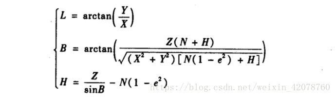
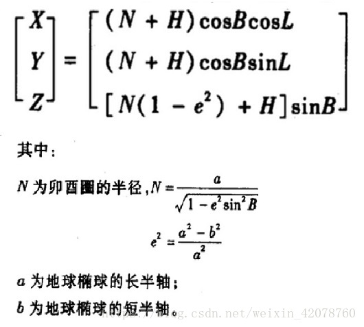
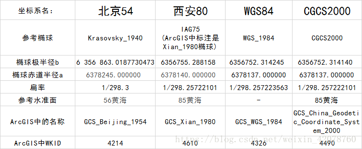

# 了解GIS基础知识
2018.10-2018.11

## 1、坐标系，构成要素、参数

为了说明质点的位置、运动的快慢、方向等，必须选取其坐标系。在参照系中，为确定空间一点的位置，按规定方法选取的有次序的一组数据，这就叫做“坐标”。在某一问题中规定坐标的方法，就是该问题所用的坐标系。坐标系的种类很多，常用的坐标系有：笛卡尔直角坐标系、平面极坐标系、柱面坐标系（或称柱坐标系）和球面坐标系(或称球坐标系)等。中学物理学中常用的坐标系，为直角坐标系，或称为正交坐标系。

从广义上讲：事物的一切抽象概念都是参照于其所属的坐标系存在的，同一个事物在不同的作标系中就会有不同抽象概念来表示，坐标系表达的事物有联系的抽象概念的数量【既坐标轴的数量】就是该事物所处空间的维度。

## 2、地理坐标系和投影坐标系
 
### 地理坐标系
地理坐标系（Geographic Coordinate System），是使用三维球面来定义地球表面位置，以实现通过经纬度对地球表面点位引用的坐标系。一个地理坐标系包括角度测量单位、本初子午线和参考椭球体三部分。在球面系统中，水平线是等纬度线或纬线。垂直线是等经度线或经线。
- 参心坐标系 
    
    以地球质心为旋转椭球面的中心的坐标系，叫地心坐标系
    
- 地心坐标系

### 投影坐标系
投影坐标系 （Projection Coordinate System）平面坐标系统地图单位通常为米 ，也称非地球投影坐标系统（notearth），或者是平面坐标。

投影坐标系使用基于X,Y值的坐标系统来描述地球上某个点所处的位置。这个坐标系是

从地球的近似椭球体投影得到的，它对应于某个地理坐标系。

投影坐标系由 以下参数确定
- 地理坐标系（由基准面确定，比如：北京54、西安80、WGS84）
- 投影方法（比如高斯－克吕格、Lambert投影、Mercator投影）

## 3、坐标系转换
### 经纬度GCS与平面直角坐标系PCS转换
**平面直角坐标系转经纬度PCS->GCS**

**经纬度转平面直角坐标系GCS->PCS**

## 4、常用坐标系
### 经纬度坐标系(GCS-地理坐标系)

#### 参心坐标系：

椭圆中心不在地球中心的坐标系，通常是为准确局部国家地区服务。如西安80 北京54        

**西安80：** 

IGA75椭球体，改革开放后建立坐标系，原点在陕西泾阳永乐镇，参数如下：极半径b=6 356 755m，赤道半径a=6 378 140m，扁率=1/298.25722101，高程系：85黄海系

**北京54：**

克拉索夫斯基椭球体，1942年与苏联联测建立的坐标系，原点在苏联的普尔科沃。参数如下：椭球体：Krasovsky椭球，极半径b=6 356 863.0187730473 m，赤道半径a=6 378 245m，扁率=1/298.3，高程系：56黄海系

#### 地心坐标系：

以地球质心为原点的坐标系，具有唯一性。如WGS84 CGCS2000

**WGS84：**

WGS84椭球体，GPS星历坐标系，全球通用，参数如下：极半径b=6 356 752.314 245 179 5m，赤道半径a=6 378 137 m，扁率=1/298.257223563

**CGCS2000：**
CGCS2000椭球体，北斗系统坐标系，与WGS偏差仅0.11mm，参数如下：极半径b=6 356 752.314 140 355 8m，赤道半径a=6 378 137m，扁率=1/298.257222101，高程系：85黄海系

### 平面直角坐标系(PCS-投影坐标系)

**高斯克吕格（Gauss Kruger）投影** 

横轴墨卡托（Transverse Mercator）投影：投影面与切面平行，地轴与投影柱中心轴垂直，每个3/6度绕地轴转动，起算经线不同，Y方向前需加投影带号。投影特点：投影后的地图，角度不变，面积有变；离中央经线越远的地区，面积变化越大，此投影合适用于导航；投影椭圆柱面是横着的；投影椭圆柱面与椭球体相切。适用比例尺：1：2.5万~1：100万等使用6度分带法；1：5000~1：10000使用3度分带法。

**墨卡托（Mercator）投影：** 

投影面与地轴垂直，投影柱中心轴与地轴方向相同，可以切圆柱，也可以割圆柱。

**通用横轴墨卡托（UTM）投影：**

除割圆柱外，其他与高斯克吕格投影一样。割于纬度80°S和84°N。中央经线投影后，是原长度的0.9996倍。不过，起算投影带是180°经线，174°W则是第二个投影带的起算经线，作为大地测量和地形测量的投影基础。

**Lambert投影：**

我国的基本比例尺地形图(1:5千，1:1万，1:2.5万，1:5万，1:10万，1:25万，1:50万，1:100万)中，1:100万地形图、大部分省区图以及大多数这一比例尺的地图多采用Lambert投影，为等角圆锥投影，国际上用此投影编制1∶100万地形图和航空图。

### 当前互联网地图的坐标系
地球坐标 (WGS84)

    国际标准，从专业GPS 设备中取出的数据的坐标系
    国际地图提供商使用的坐标系

火星坐标 (GCJ-02)也叫国测局坐标系

    中国标准，从国行移动设备中定位获取的坐标数据使用这个坐标系
    国家规定： 国内出版的各种地图系统（包括电子形式），必须至少采用GCJ-02对地理位置进行首次加密。

百度坐标 (BD-09)

    百度标准，百度 SDK，百度地图，Geocoding 使用
    (本来就乱了，百度又在火星坐标上来个二次加密)
等等

## 5、EPSG
EPSP的英文全称是European Petroleum Survey Group，中文名称为欧洲石油调查组织。这个组织成立于1986年，2005年并入IOGP(InternationalAssociation of Oil & Gas Producers)，中文名称为国际油气生产者协会。

EPSG对世界的每一个地方都制定了地图，但是由于座标系不同，所以地图也各不相同。

**中国地图**

比如对于中国来讲，以地球的几何球心为中心的地图就是EPSG:4479，以地球的椭球焦点为中心就是EPSG:4480，此外还有EPSG:4490，因为选择不同的座标系对于油气勘探的成本至关重要，所以有不同的座标系。

**世界地图**

**EPSG:4326**

在世界地图方面，EPSG:4326是比较著名的一个，因为由美国主导的GPS系统就是在用它，它还有一个名气更大的别名叫作WGS84，WGS(World Geodetic System)是世界大地测量系统的意思，由于是1984年定义的，所以叫WGS84，之前的版本还有WGS72、WGS66、WGS60。

**EPSG:3857**

另一个比较知名的编码是EPSG:3857，这也是一张世界地图，目前主要是各大互联网地图公司以它为基准，例如Google地图，Microsoft地图都在用它。

所有这些EPSG编码的具体含义都可以在这个[网站](https://link.zhihu.com/?target=https%3A//epsg.io/)上查到。

				
				
## 参考资料
- [GIS的基本概念二：大地水准面、旋转椭球体（椭球体）、大地基准面](https://blog.csdn.net/kehongyong/article/details/16916825)				
- [GIS中的坐标系及转换](https://blog.csdn.net/weixin_42078760/article/details/80902529?utm_source=blogxgwz3)				

