# 了解GIS数据存储
2018.11-2018.12

## GIS数据格式及存储方式的基本概念

### 空间数据结构：
地理实体的特征：  
1、 属性特征；
2、 空间特征；
3、 时间特征；  
地理实体数据的类型：  
1、 属性数据；
2、 几何数据；
3、 关系数据；
### GIS基本数据元素
- 用图层（Layer）来抽象表达地物的集合
> 图层是某一类地物的集合，例如道路图层，河流图层，房屋图层。

- 用要素（Feature）来表达地物，例如一个公交站用一个点标注来表示

- 用符号（style）来标识地物分类

> GIS概念中有相当多的数据文件格式，我们经常接触到的数据格式可以大致分为“**栅格数据**”与“**矢量数据**”这两类。
这两类数据分别对应着不同的应用场景，我们通常使用“栅格数据”来当作底图，示意地理构造物（如山地、河流、湖泊、建筑物、
道路等）的空间形态（如形状、位置、大小等），并可以进行一些简易的空间分析；使用“矢量数据”来参与业务逻辑的实现与分析，
进行复杂的空间分析。本期我们将介绍GIS数据格式及存储方式的基本概念。

### 栅格数据
栅格数据是以规则像元阵列表示空间对象的数据结构，阵列中每个数据表示空间对象的属性特征。简单说来，一个“像元”就是一个像素，
一张栅格图片以当前分辨率被分割成了N多的规则小块，每一个规则小块就是一个像素，栅格图像的清晰度会随着放大比例的增大而降低，
如图1所示。

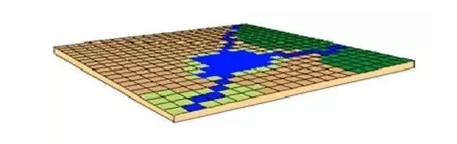


GIS系统的栅格数据格式有很多种，其中常用的有.jpg、.png、.tif等。我们在一些工作任务中会利用一些电子地图下载器来获取研究
范围内的卫星地图，下载得到的格式就是.jpg或者.png。.tif格式的数据不同之处在于它具有空间地理坐标，
我们在TransCAD中通常导入.tif作为底图，进行配准后，再进行路网等交通地理要素的绘制。


### 矢量数据
GIS中的矢量数据代表地图图形的各离散点平面坐标（x,y）的有序集合。如下图举例说明。
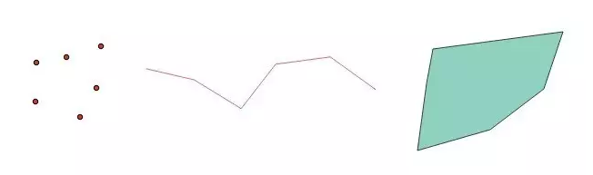

上图中就是GIS中基本的点、线、面模型，也就是最常见的矢量数据。与删格数据相比，矢量数据最大的特点就是放大不失真，可以任意
放大或缩小图形而不会影响出图的清晰度。矢量数据中每个元素都带有属性值，这些属性值使得该元素具有业务相关的能力。我们在TransCAD
中做的一些数据处理运算，本质上其实就是在对矢量数据的属性进行归并计算。常见的矢量数据格式有.dwg、.dxf、.shp、.kml、.geosjon等。
其中.dwg、.dxf为CAD的文件格式，.shp为ESRI(美国环境系统研究所)的矢量格式（现已成国际标准）。

#### Shapefile
> ESRI 为存储地理信息开发了三种主要数据格式 - coverage 格式、shapefile 格式及geodatabase格式。

Shapefile 是一种用于存储地理要素的几何位置和属性信息的非拓扑简单格式。shapefile 中的地理要素可通过点、线或面（区域）来表示。
包含 shapefile的工作空间还可以包含 dBASE 表，它们用于存储可连接到shapefile 的要素的附加属性。

**一个Shape文件包括三个文件：一个主文件(*.shp)，一个索引文件(*.shx)，和一个dBASE(*.dbf)表**
- .shp - 用于存储要素几何的主文件   
    > 主文件是一个直接存取，变长度记录的文件，其中每个记录描述构成一个地理特征（Feature）的所有vertices坐标值
- .shx - 用于存储要素几何索引的索引文件
    > 在索引文件中，每条记录包含对应主文件记录距离主文件头开始的偏移量
- .dbf - 用于存储要素属性信息的 dBASE 表
    > dBASE表包含SHP文件中每一个Feature的特征属性，表中几何记录和属性数据之间的一一对应关系是基于记录数目的ID。
    在dBASE文件中的属性记录必须和主文件中的记录顺序是相同的。图形数据和属性数据通过索引号建立一一对应的关系

其他文件
- .prj - 用于存储坐标系信息的文件；
- .sbn 和 .sbx - 用于存储要素空间索引的文件
- .fbn 和 .fbx - 用于存储只读shapefile 的要素空间索引的文件
- .ain 和 .aih - 用于存储某个表中或专题属性表中活动字段属性索引的文件
- .atx 文件针对各个 shapefile 或在 ArcCatalog 中创建的 dBASE 属性索引而创建

shapefile文件格式详细信息参考地址：[Shapefile文件格式详解](http://www.cppblog.com/alantop/archive/2008/08/14/58880.html)

#### GDAL
is a translator library for raster and vector geospatial data formats that is released under an X/MIT style Open Source
 license by the Open Source Geospatial Foundation. As a library, it presents a [single raster abstract data model](https://www.gdal.org/gdal_datamodel.html)
 and [single vector abstract data model](https://www.gdal.org/ogr_arch.html) to the calling application for all supported formats.


### 数据存储方式
我们这里说到的数据储存方式主要分为两类：本地文件存储方式、数据库存储方式。

- 所谓本地文件存储方式，
是我们最常使用的。比如使用CAD或者TransCAD打开某个文件或者工程，就是在读取本地机器上存储的数据。


- 各位都听说过数据库，也都大致了解数据库的功能。
普通的一张数据表可以存储进入数据库，那么地图文件，比如矢量数据能不能存储在数据库中呢？答案当然是肯定的！
空间数据库就是专门做这个的，常用的空间数据库有Postgresql（Postgis拓展）、Mysql（Mysqlspatial拓展）、Oracle（Oraclespatial拓展）等。

### [OGC](http://www.opengeospatial.org/) （开放地理空间信息联盟）
OGC 全称是开放地理空间信息联盟(Open Geospatial Consortium),是一个非盈利的国际标准组织，它制定了数据和服务的一系列标准，
GIS厂商按照这个标准进行开发可保证空间数据的互操作。

### [Simple Features](https://en.wikipedia.org/wiki/Simple_Features)
Simple Features (officially Simple Feature Access) is both an Open Geospatial Consortium (OGC) and International Organization 
for Standardization (ISO) standard ISO 19125 that specifies a common storage and access model of mostly two-dimensional geometries (point, line, polygon, multi-point, multi-line, etc.) used by geographic information systems.

*Geometry*
缩写|解释
--|--
FID| Feature ID column in the implementation of feature tables based on predefined data types
GID| Geometry ID column in the implementation of feature tables based on predefined datatypes
MM | Multimedia
SQL| Structured query language, not an acronym, pronounced as "sequel"
SQL/MM| SQL Multimedia and Application Packages
SRID| Spatial Reference System Identifier(空间坐标参考系统)
SRTEXT| Spatial Reference System Well Known Text
WKB| Well-Known Binary (representation for example, geometry)
WKT| Well-Known Text
WKTR| Well-Known Text Representation

## 空间数据格式
###  Well-Known Text (WKT) format
> The OpenGIS specification provides a Backus-Naur grammar(巴克斯语法) that specifies the formal production rules for writing WKT values

Geometry Type| Text Literal Representation |Comment
-|-|-
Point| Point (10 10) | a Point
LineString| LineString ( 10 10, 20 20, 30 40)| a LineString with 3 points
Polygon |Polygon((10 10, 10 20, 20 20, 20 15, 10 10))| a Polygon with 1 exteriorRing and 0 interiorRings
Multipoint| MultiPoint ((10 10), (20 20))| a MultiPoint with 2 points
MultiLineString| MultiLineString ((10 10, 20 20), (15 15, 30 15)) |a MultiLineString with 2 linestrings
MultiPolygon |MultiPolygon (</br>((10 10, 10 20, 20 20, 20 15, 10 10)),</br>((60 60, 70 70, 80 60, 60 60 ))</br>) |a MultiPolygon with 2 polygons
GeomCollection |GeometryCollection ( POINT (10 10), POINT (30 30), LINESTRING (15 15, 20 20) ) |a GeometryCollection consisting of 2 Point values and a LineString value
Polyhedron |Polyhedron Z (</br> ((0 0 0, 0 0 1, 0 1 1, 0 1 0, 0 0 0)), </br>((0 0 0, 0 1 0, 1 1 0, 1 0 0, 0 0 0)),</br> ((0 0 0, 1 0 0, 1 0 1, 0 0 1, 0 0 0)), </br>((1 1 0, 1 1 1, 1 0 1, 1 0 0, 1 1 0)),</br> ((0 1 0, 0 1 1, 1 1 1, 1 1 0, 0 1 0)),</br> ((0 0 1, 1 0 1, 1 1 1, 0 1 1. 0 0 1))</br> ) | A polyhedron cube, corner at the origin and opposite corner at (1, 1, 1).
Tin| Tin Z ( </br>((0 0 0, 0 0 1, 0 1 0, 0 0 0)), </br>((0 0 0, 0 1 0, 1 0 0, 0 0 0)), </br>((0 0 0, 1 0 0, 0 0 1, 0 0 0)), </br>((1 0 0, 0 1 0, 0 0 1, 1 0 0)), </br>)| A tetrahedron (4 triangular faces), corner at the origin and each unit coordinate digit.
Point |Point Z (10 10 5)| a 3D Point
Point| Point ZM (10 10 5 40) |the same 3D Point with M value of 40
Point| Point M (10 10 40) a 2D Point with M value of 40


### Well-Known Binary (WKB) format
The Well-known Binary Representation for Geometry is obtained by serializing a geometric object as a sequence
of numeric types drawn from the set {Unsigned Integer, Double} and then serializing each numeric type as
a sequence of bytes using one of two well defined, standard, binary representations for numeric types (NDR,
XDR). The specific binary encoding (NDR or XDR) used for a geometry representation is described by a one-byte
tag that precedes the serialized bytes. The only difference between the two encodings of geometry is one of byte
order, the XDR encoding is Big Endian, and the NDR encoding is Little Endian.

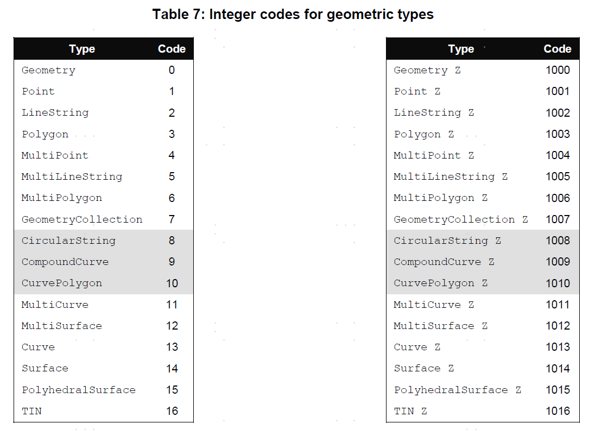
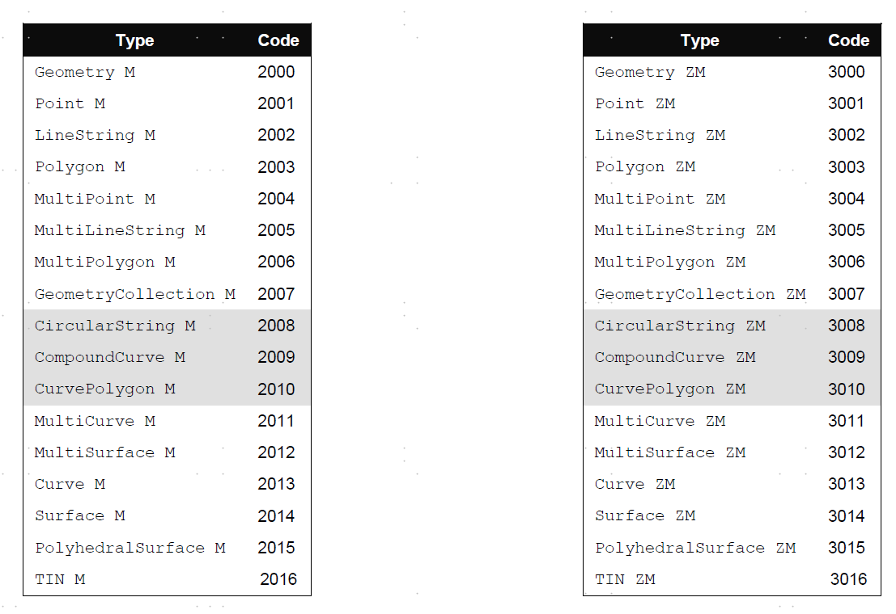

#### 数值编码方式
- XDR (Big Endian) encoding of numeric types  
The XDR representation of an Unsigned Integer is Big Endian (most significant byte first).
The XDR representation of a Double is Big Endian (sign bit is first byte).

- NDR (Little Endian) encoding of numeric types
The NDR representation of an Unsigned Integer is Little Endian (least significant byte first).
The NDR representation of a Double is Little Endian (sign bit is last byte).

```
Point {
    double x;
    double y}
PointZ {
    double x;
    double y;
    double z}
PointM {
    double x;
    double y;
    double m}
PointZM {
    double x;
    double y;
    double z;
    double m}
LinearRing {
    uint32 numPoints;
    Point points[numPoints]}
LinearRingZ {
    uint32 numPoints;
    PointZ points[numPoints]}
LinearRingM {
    uint32 numPoints;
    PointM points[numPoints]}
LinearRingZM {
    uint32 numPoints;
    PointZM points[numPoints]}
    
WKBPoint {
    byte byteOrder;
    static uint32 wkbType = 1;
    Point point}
    
WKBPointZ {
    byte byteOrder;
    static uint32 wkbType = 1001;
    PointZ point}
    
WKBLineString {
    byte byteOrder;
    static uint32 wkbType = 2;
    uint32 numPoints;
    Point points[numPoints]}
    
WKBPolygon {
    byte byteOrder;
    static uint32 wkbType = 3;
    uint32 numRings;
    LinearRing rings[numRings]}
```
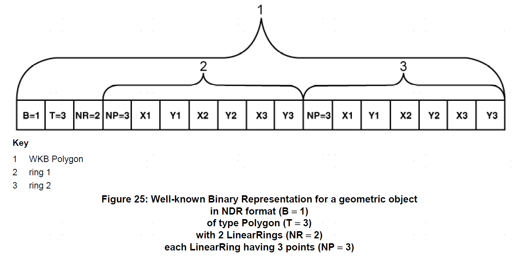

#### 用WKT表示坐标系
- 投影坐标系表示
```
PROJCS["NAD_1983_UTM_Zone_10N",
    <geographic cs>,
    PROJECTION["Transverse_Mercator"],
    PARAMETER["False_Easting",500000.0],
    PARAMETER["False_Northing",0.0],
    PARAMETER["Central_Meridian",-123.0],
    PARAMETER["Scale_Factor",0.9996],
    PARAMETER["Latitude_of_Origin",0.0],
    UNIT["Meter",1.0]]
```

- 地理坐标系
```
GEOGCS["GCS_North_American_1983",
    DATUM["D_North_American_1983",
    ELLIPSOID["GRS_1980",6378137,298.257222101]],
    PRIMEM["Greenwich",0],
    UNIT["Degree",0.0174532925199433]]
```

- 完整的投影坐标系
``` 
PROJCS["NAD_1983_UTM_Zone_10N",
    GEOGCS["GCS_North_American_1983",
        DATUM[ "D_North_American_1983",ELLIPSOID["GRS_1980",6378137,298.257222101]],
        PRIMEM["Greenwich",0],UNIT["Degree",0.0174532925199433]],
    PROJECTION["Transverse_Mercator"],PARAMETER["False_Easting",500000.0],
    PARAMETER["False_Northing",0.0],PARAMETER["Central_Meridian",-123.0],
    PARAMETER["Scale_Factor",0.9996],PARAMETER["Latitude_of_Origin",0.0],
    UNIT["Meter",1.0]]
```
"1、常用数据类型和格式，矢量、栅格，shp、tif等
2、空间数据库，oracle/mysql/postgis/sqlserver/
   spatialite等，空间函数、空间索引
3、常用GIS数据存储方式，二进制、WKT、WKB、GeoJson"				
								
### GEOJSON
GeoJSON is a format for encoding a variety of geographic data structures.
``` 
{
  "type": "Feature",
  "geometry": {
    "type": "Point",
    "coordinates": [125.6, 10.1]
  },
  "properties": {
    "name": "Dinagat Islands"
  }
}
```
GeoJSON supports the following geometry types: Point, LineString, Polygon, MultiPoint, MultiLineString, and MultiPolygon. Geometric objects with additional properties are Feature objects. Sets of features are contained by FeatureCollection objects.

> GeoJSON is a geospatial data interchange format based on JavaScript
   Object Notation (JSON).  It defines several types of JSON objects and
   the manner in which they are combined to represent data about
   geographic features, their properties, and their spatial extents.
   GeoJSON uses a geographic coordinate reference system, World Geodetic
   System 1984, and units of decimal degrees. 
   
## 空间数据库（GeoSpatial)
### oracle 空间数据库
#### 介绍
Oracle Spatial, often referred to as Spatial, provides a SQL schema and functions that facilitate the storage, retrieval,
 update, and query of collections of spatial features in an Oracle database. Spatial consists of the following:
- A schema (MDSYS) that prescribes the storage, syntax, and semantics of supported geometric data types
- A spatial indexing mechanism (空间索引)
- Operators, functions, and procedures for performing area-of-interest queries, spatial join queries, and other spatial analysis operations
- Functions and procedures for utility and tuning operations
- Topology data model for working with data about nodes, edges, and faces in a topology 
- Network data model for representing capabilities or objects that are modeled as nodes and links in a network 
- GeoRaster, a feature that lets you store, index, query, analyze, and deliver GeoRaster data, that is, raster image and 
  gridded data and its associated metadata 

#### 对象关系模型
Spatial supports the object-relational model for representing geometries. This model stores an entire geometry in the Oracle
 native spatial data type for vector data, SDO_GEOMETRY. An Oracle table can contain one or more SDO_GEOMETRY columns. 
 The object-relational model corresponds to a "SQL with Geometry Types" implementation of spatial feature tables in the
  Open GIS ODBC/SQL specification for geospatial features.

对象关系模型包含如下好处:
- Support for many geometry types, including arcs, circles, compound polygons, compound line strings, and optimized rectangles
- Ease of use in creating and maintaining indexes and in performing spatial queries
- Index maintenance by the Oracle database
- Geometries modeled in a single column
- Optimal performance

#### 数据模型
- Element
- Geometry
- Layer
- Coordinate System
- Tolerance （容忍度）
    > 精度级别， 误差， The tolerance value must be a positive number greater than zero

#### 查询模型
The two operations are referred to as primary and secondary filter operations.
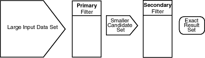
- The **primary filter** permits fast selection of candidate records to pass along to the secondary filter. 
The primary filter compares geometry approximations to reduce computation complexity and is considered a lower-cost filter.
 Because the primary filter compares geometric approximations, it returns a superset of the exact result set.

- The **secondary filter** applies exact computations to geometries that result from the primary filter. 
The secondary filter yields an accurate answer to a spatial query. The secondary filter operation is computationally expensive,
 but it is only applied to the primary filter results, not the entire data set.

#### 空间索引
- R-Tree Indexing
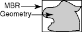
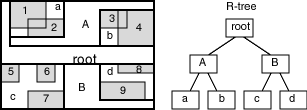
- R-Tree Quality

#### 简单示例
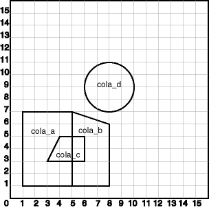

``` 
-- Create a table 
create table cola_markets (
	mkt_id number primary key,
	name varchar2(32),
	shape SDO_GEOMETRY);

-- The next INSERT statement creates an area of interest
insert into cola_markets values(
	1, 
	'cola_a',
	SDO_GEOMETRY(
		2003, -- two-dimensional polygon
		NULL,
		NULL,
		SDO_ELEM_INFO_ARRAY(1, 1003, 3), -- one rectangle (1003 = exterior)
		SDO_ORDINATE_ARRAY(1,1, 5,7) -- only 2 points needed to
							-- define rectangle (lower left and upper right) with
							-- Cartesian-coordinate(笛卡尔坐标) data 
	)
);

insert into cola_markets values(
	2, 
	'cola_b',
	SDO_GEOMETRY(
		2003, -- two-dimensional polygon
		NULL,
		NULL,
		SDO_ELEM_INFO_ARRAY(1, 1003, 1), -- one polygon (exterior polygon ring)
		SDO_ORDINATE_ARRAY(5,1, 8,1, 8,6, 5,7, 5,1)
  )
);

INSERT INTO cola_markets VALUES(
  3,
  'cola_c',
  SDO_GEOMETRY(
    2003,  -- two-dimensional polygon
    NULL,
    NULL,
    SDO_ELEM_INFO_ARRAY(1,1003,1), -- one polygon (exterior polygon ring)
    SDO_ORDINATE_ARRAY(3,3, 6,3, 6,5, 4,5, 3,3)
  )
);


INSERT INTO cola_markets VALUES(
  4,
  'cola_d',
  SDO_GEOMETRY(
    2003,  -- two-dimensional polygon
    NULL,
    NULL,
    SDO_ELEM_INFO_ARRAY(1,1003,4), -- one circle
    SDO_ORDINATE_ARRAY(8,7, 10,9, 8,11)
  )
);

---------------------------------------------------------------------------
-- UPDATE METADATA VIEW --
---------------------------------------------------------------------------
-- Update the USER_SDO_GEOM_METADATA view. This is required
-- before the Spatial index can be created. Do this only once for each
-- layer (that is, table-column combination; here: COLA_MARKETS and SHAPE).

INSERT INTO USER_SDO_GEOM_METADATA(
	TABLE_NAME,
	COLUMN_NAME,
	DIMINFO,
	SRID)
VALUES(
	'cola_markets',
	'shape',
	SDO_DIM_ARRAY( -- 20X20 grid
		SDO_DIM_ELEMENT('X', 0, 20, 0.005),
		SDO_DIM_ELEMENT('Y', 0, 20, 0.005)
		),
	NULL --SRID
);


-------------------------------------------------------------------
-- CREATE THE SPATIAL INDEX --
-------------------------------------------------------------------
create index cola_spatial_idx
	ON cola_markets(shape)
	INDEXTYPE is MDSYS.SPATIAL_INDEX;
-- Preceding statement created an R-tree index.

-------------------------------------------------------------------
-- PERFORM SOME SPATIAL QUERIES --
-------------------------------------------------------------------
-- Return the topological intersection of two geometries.
select SDO_GEOM.SDO_INTERSECTION(c_a.shape, c_c.shape, 0.005)
	from cola_markets c_a, cola_markets c_c
	where c_a.name = 'cola_a' and c_c.name = 'cola_c';

-- Do two geometries have any spatial relationship?
select SDO_GEOM.RELATE(c_b.shape, 'anyinteract', c_d.shape, 0.005)
	FROM cola_markets c_b, cola_markets c_d
  WHERE c_b.name = 'cola_b' AND c_d.name = 'cola_d';

-- Return the areas of all cola markets.
SELECT name, SDO_GEOM.SDO_AREA(shape, 0.005) FROM cola_markets;

-- Return the distance between two geometries.
select SDO_GEOM.SDO_DISTANCE(c_b.shape, c_d.shape, 0.005) 
	from cola_markets c_b, cola_markets c_d 
	where c_b.name = 'cola_b' AND c_d.name = 'cola_d';

-- Is a geometry valid?
SELECT c.name, SDO_GEOM.VALIDATE_GEOMETRY_WITH_CONTEXT(c.shape, 0.005)
   FROM cola_markets c; 

-- Is a layer valid? (First, create the results table.)
create table val_results (sdo_rowid rowid, result varchar2(2000));
call SDO_GEOM.VALIDATE_LAYER_WITH_CONTEXT('COLA_MARKETS', 'SHAPE', 'VAL_RESULTS', 2);
select * from val_results;
```

#### SDO_GEOMETRY Object Type
Oracle Spatial defines the object type SDO_GEOMETRY as:
```
CREATE TYPE sdo_geometry AS OBJECT (
 SDO_GTYPE NUMBER, 
 SDO_SRID NUMBER,
 SDO_POINT SDO_POINT_TYPE,
 SDO_ELEM_INFO SDO_ELEM_INFO_ARRAY,
 SDO_ORDINATES SDO_ORDINATE_ARRAY);
```

##### SDO_GTYPE
The SDO_GTYPE value is 4 digits in the format DLTT, where:
- D identifies the number of dimensions (2, 3, or 4)
- L identifies the linear referencing measure dimension for a three-dimensional linear referencing system (LRS) geometry,
 that is, which dimension (3 or 4) contains the measure value. For a non-LRS geometry, or to accept the Spatial default
  of the last dimension as the measure for an LRS geometry, specify 0.
- TT identifies the geometry type (00 through 09, with 10 through 99 reserved for future use).
Value|	Geometry Type
-|-
DL00|UNKNOWN_GEOMETRY
DL02|LINE or CURVE
DL03|POLYGON or SURFACE
DL04|COLLECTION
DL05|MULTIPOINT
DL06|MULTILINE or MULTICURVE
DL07|MULTIPOLYGON or MULTISURFACE
DL08|SOLID
DL09|MULTISOLID

##### SDO_ELEM_INFO
The SDO_ELEM_INFO attribute is defined using a varying length array of numbers. This attribute lets you know how to interpret the ordinates stored in the SDO_ORDINATES attribute 

Each triplet(3个一组) set of numbers is interpreted as follows:
- SDO_STARTING_OFFSET  
    每个元素的起始位置（从1开始）
- SDO_ETYPE  -- Indicates the type of the element.  元素类型
    - 1, 2, 1003, and 2003 are considered simple elements.
    - 4, 1005, 2005, 1006, and 2006 are considered compound elements.
    - 1007: solid element
- SDO_INTERPRETATION -- Means one of two things, depending on whether or not SDO_ETYPE is a compound element.
    - 辅助解释元素信息的
    > SDO_ETYPE和SDO_INTERPRETATION的关系详见[Values and Semantics in SDO_ELEM_INFO](https://docs.oracle.com/cd/E11882_01/appdev.112/e11830/sdo_objrelschema.htm#SPATL496)
##### SDO_GEOMETRY 对象的方法
```
select c.shape.Get_Dims() 
	from cola_markets c;

select c.shape.Get_Gtype() 
	from cola_markets c;

SELECT c.shape.Get_WKT()
  FROM cola_markets c ;
```
##### SDO_GEOMETRY Constructors (构造方法)
```html
SDO_GEOMETRY(wkt CLOB, srid NUMBER DEFAULT NULL);
SDO_GEOMETRY(wkt VARCHAR2, srid NUMBER DEFAULT NULL);
SDO_GEOMETRY(wkb BLOB, srid NUMBER DEFAULT NULL);

example:
SELECT SDO_GEOMETRY('POINT(-79 37)') FROM DUAL;
```
#### TIN-Related Object Types
TIN : triangulated irregular networks (不规则三角网)
- SDO_TIN
- SDO_TIN_BLK_TYPE
- SDO_TIN_BLK

### Querying Spatial Data
Spatial uses a two-tier query model with primary and secondary filter operations to resolve spatial queries and spatial joins
#### Spatial Query
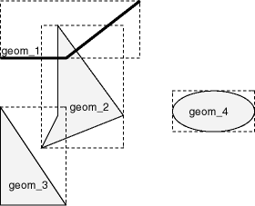
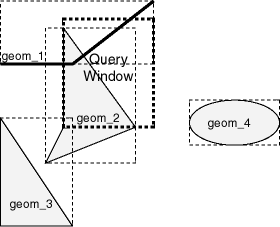

##### Primary Filter Operator
The primary filter uses the index data to determine only if a set of candidate object pairs may interact. Specifically, the primary filter checks to see if the MBRs of the candidate objects interact, not whether the objects themselves interact
```html
SDO_FILTER(geometry1 SDO_GEOMETRY, geometry2 SDO_GEOMETRY, param VARCHAR2)
```
In the preceding syntax:
- _geometry1_ is a column of type SDO_GEOMETRY in a table. This column must be spatially indexed.
- _geometry2_ is an object of type SDO_GEOMETRY. This object may or may not come from a table. If it comes from a table, it may or may not be spatially indexed.
- _param_ is an optional string of type VARCHAR2. It can specify either or both of the min_resolution and max_resolution keywords.
```html
SELECT c.name FROM cola_markets c 
  WHERE sdo_filter(c.shape, SDO_geometry(2003,NULL,NULL,
                                       SDO_elem_info_array(1,1003,3),
                                       SDO_ordinate_array(4,6, 7,8))
                           ) = 'TRUE'; 
```
##### Primary and Secondary Filter Operator
The SDO_RELATE operator, performs both the primary and secondary filter stages when processing 
a query. The secondary filter ensures that only candidate objects that actually interact are selected. 
This operator can be used only if a spatial index has been created on two dimensions of data. 
In the preceding syntax:
- geometry1 is a column of type SDO_GEOMETRY in a table. This column must be spatially indexed.
- geometry2 is an object of type SDO_GEOMETRY. This object may or may not come from a table. If it comes from a table, it may or may not be spatially indexed.
- param is a quoted string with the mask keyword and a valid mask value, and optionally either or both of the min_resolution and max_resolution keywords

```html
SDO_RELATE(geometry1  SDO_GEOMETRY,
           geometry2  SDO_GEOMETRY,
           param      VARCHAR2) 
```
-  param   
> Valid mask keyword values are one or more of the following in the nine-intersection pattern: TOUCH, OVERLAPBDYDISJOINT, 
OVERLAPBDYINTERSECT, EQUAL, INSIDE, COVEREDBY, CONTAINS, COVERS, ANYINTERACT, ON. Multiple masks are combined with the 
logical Boolean operator OR, for example, 'mask=inside+touch'; 

```html
SELECT c.name FROM cola_markets c 
  WHERE sdo_relate(c.shape, 
                 SDO_geometry(2003,NULL,NULL,
                             SDO_elem_info_array(1,1003,3),
                             SDO_ordinate_array(2,2,3,3)),
                    'mask=CONTAINS'
                           ) = 'TRUE'; 
```

##### Within-Distance Operator
```html
SDO_WITHIN_DISTANCE(geometry1  SDO_GEOMETRY, 
                    aGeom      SDO_GEOMETRY,
                    params     VARCHAR2);
                    
```
Ex:
```html
SELECT c.mkt_id, c.name
  FROM cola_markets c
  WHERE SDO_WITHIN_DISTANCE(c.shape,
            SDO_GEOMETRY(2003, NULL, NULL,
              SDO_ELEM_INFO_ARRAY(1,1003,3),
              SDO_ORDINATE_ARRAY(11,8, 10,9)),
						'distance=1'
            ) = 'TRUE';
```

##### Nearest Neighbor Operator
```html
SDO_NN(geometry1  SDO_GEOMETRY, 
       geometry2  SDO_GEOMETRY,
       param      VARCHAR2
       [, number  NUMBER]);
```
Ex:
```html
SELECT /*+ INDEX(cola_markets cola_spatial_idx) */
 c.mkt_id, c.name  FROM cola_markets c  WHERE SDO_NN(c.shape,
   SDO_geometry(2001, NULL, SDO_point_type(10,7,NULL), NULL,
   NULL),  'sdo_num_res=2') = 'TRUE';
```

##### Spatial Join
SDO_JOIN(table_name1, column_name1, table_name2, column_name2, params, preserve_join_order, table1_partition, table2_partition) RETURN SDO_ROWIDSET;

Ex:
Spatial joins can be used to answer questions such as Which highways cross national parks?

The following table structures illustrate how the join would be accomplished for this example:
```html
PARKS(    GID VARCHAR2(32), SHAPE SDO_GEOMETRY)
HIGHWAYS( GID VARCHAR2(32), SHAPE SDO_GEOMETRY) 
```
To perform a spatial join, use the SDO_JOIN operator, The following spatial join query, to list the GID column values of highways and parks where a highway interacts with a park, performs a primary filter operation only ('mask=FILTER'), and thus it returns only approximate results:
```html
SELECT /*+ ordered */ a.gid, b.gid 
  FROM TABLE(SDO_JOIN('PARKS', 'SHAPE', 
                      'HIGHWAYS', 'SHAPE',
                      'mask=FILTER')) c,
       parks a, 
       highways b
  WHERE c.rowid1 = a.rowid AND c.rowid2 = b.rowid;
```
The following spatial join query requests the same information as in the preceding example, but it performs both primary and secondary filter operations ('mask=ANYINTERACT'), and thus it returns exact results:
```html
SELECT /*+ ordered */ a.gid, b.gid 
  FROM TABLE(SDO_JOIN('PARKS', 'SHAPE', 
                      'HIGHWAYS', 'SHAPE',
                      'mask=ANYINTERACT')) c,
       parks a, 
       highways b
  WHERE c.rowid1 = a.rowid AND c.rowid2 = b.rowid;
```
#### 空间操作Spatial Operators
**Main Spatial Operators**  
Operator|	Description
-|-
SDO_FILTER|Specifies which geometries may interact with a given geometry.
SDO_JOIN|Performs a spatial join based on one or more topological relationships.
SDO_NN|Determines the nearest neighbor geometries to a geometry.
SDO_NN_DISTANCE|Returns the distance of an object returned by the SDO_NN operator.
SDO_RELATE|Determines whether or not two geometries interact in a specified way. (See also Table 19-2 for convenient alternative operators for</br> performing specific mask value operations.)
SDO_WITHIN_DISTANCE|Determines if two geometries are within a specified distance from one another.

**Convenience Operators for SDO_RELATE Operations**  
- SDO_ANYINTERACT
- SDO_CONTAINS
- SDO_COVEREDBY
- SDO_COVERS
- SDO_EQUAL
- SDO_INSIDE
- SDO_ON
- SDO_OVERLAPBDYDISJOINT
- SDO_OVERLAPBDYINTERSECT
- SDO_OVERLAPS
- SDO_TOUCH


## 参考				
[GIS空间数据模型](http://www.docin.com/p-2007241032.html)   
[GDAL](https://www.gdal.org/)  
[OGC Spatial 标准](http://www.opengeospatial.org/standards/sfs)  
[Mysql Spatial](https://dev.mysql.com/doc/refman/5.7/en/spatial-types.html)  
[Oracle Spatial Concept](https://docs.oracle.com/en/database/oracle/oracle-database/12.2/spatl/spatial-concepts.html#GUID-67E4037F-C40F-442A-8662-837DD5539784)  
[Oracle Spatial Developer Guide](https://docs.oracle.com/cd/E11882_01/appdev.112/e11830/toc.htm)  
[PostGIS](http://www.postgis.net/)  
[GeoJSON](http://geojson.org/)


