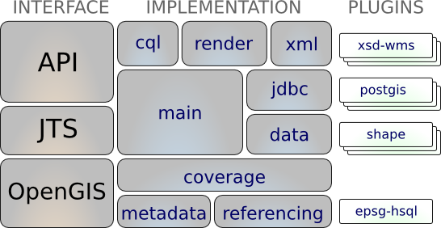
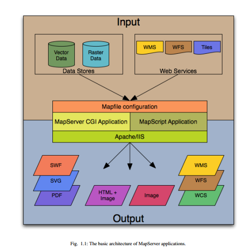
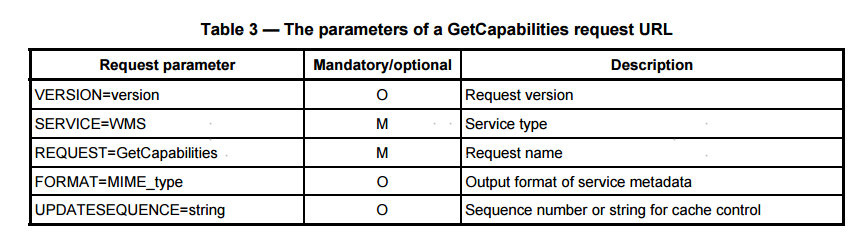
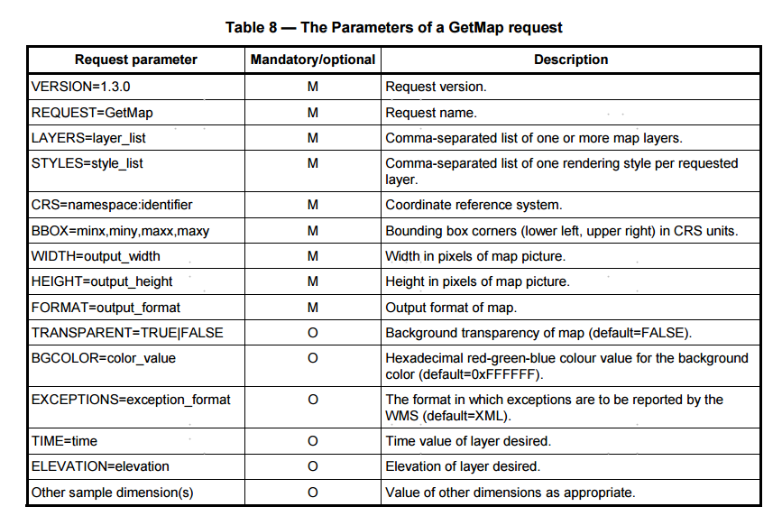
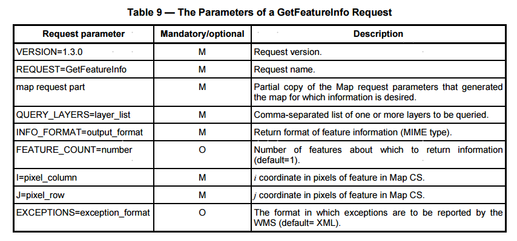
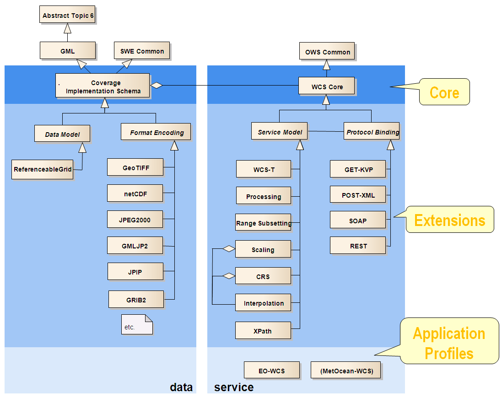
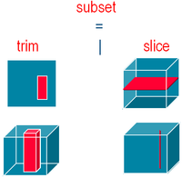

# GIS数据访问与发布
2018.12-2019.1

## 开发组件
### GDAL 
#### GDAL - Geospatial Data Abstraction Library
> GDAL is a translator library for raster and vector geospatial data formats that is released under an X/MIT style Open
 Source license by the Open Source Geospatial Foundation. As a library, it presents a [single raster abstract data model](https://www.gdal.org/gdal_datamodel.html)
  and [single vector abstract data model](https://www.gdal.org/ogr_arch.html) to the calling application for all supported formats. It also comes with a variety
   of useful command line utilities for data translation and processing.

> OGR是GDAL项目的一个分支，功能与GDAL类似，只不过它提供对矢量数据的支持。

<li>
<a href="https://www.gdal.org/formats_list.html">Supported raster formats</a> (155 drivers) : <a href="https://www.gdal.org/frmt_gtiff.html">GeoTIFF</a>, <a href="https://www.gdal.org/frmt_hfa.html">Erdas Imagine</a>, <a href="https://www.gdal.org/frmt_ecw.html">ECW</a>, <a href="https://www.gdal.org/frmt_mrsid.html">MrSID</a>, <a href="https://www.gdal.org/frmt_jp2openjpeg.html">JPEG2000</a>, <a href="https://www.gdal.org/frmt_dted.html">DTED</a>, <a href="https://www.gdal.org/frmt_nitf.html">NITF</a>, <a href="https://www.gdal.org/drv_geopackage_raster.html">GeoPackage</a>, ... </li>
<li>
<a href="https://www.gdal.org/ogr_formats.html">Supported vector formats</a> (95 drivers): <a href="https://www.gdal.org/drv_shapefile.html">ESRI Shapefile</a>, <a href="https://www.gdal.org/drv_sde.html">ESRI ArcSDE</a>, <a href="https://www.gdal.org/drv_openfilegdb.html">ESRI FileGDB</a>, <a href="https://www.gdal.org/drv_mitab.html">MapInfo (tab and mid/mif)</a>, <a href="https://www.gdal.org/drv_gml.html">GML</a>, <a href="https://www.gdal.org/drv_libkml.html">KML</a>, <a href="https://www.gdal.org/drv_pg.html">PostGIS</a>, <a href="https://www.gdal.org/drv_oci.html">Oracle Spatial</a>, <a href="https://www.gdal.org/drv_geopackage.html">GeoPackage</a>, ... </li>
<li>
<a href="https://www.gdal.org/gdal_utilities.html">Raster utility programs</a> : <a href="https://www.gdal.org/gdalinfo.html">gdalinfo</a>, <a href="https://www.gdal.org/gdal_translate.html">gdal_translate</a>, <a href="https://www.gdal.org/gdaladdo.html">gdaladdo</a>, <a href="https://www.gdal.org/gdalwarp.html">gdalwarp</a>, ... </li>
<li>
<a href="https://www.gdal.org/ogr_utilities.html">Vector utility programs</a> : <a href="https://www.gdal.org/ogrinfo.html">ogrinfo</a>, <a href="https://www.gdal.org/ogr2ogr.html">ogr2ogr</a>, <a href="https://www.gdal.org/ogrtindex.html">ogrtindex</a>, ... </li>
<li>
<a href="https://www.gdal.org/gnm_utilities.html">Geographic Network utility programs</a> : <a href="https://www.gdal.org/gnmmanage.html">gnmmanage</a>, <a href="https://www.gdal.org/gnmanalyse.html">gnmanalyse</a>, ... </li>

#### GDAL Utility
- gdalinfo.exe 显示GDAL支持的各种栅格文件的信息。
- gdal_translate.exe 在不同的格式间进行转换。同时，潜在的执行了一些切割、重采样和使像素比例变化的任务。
- gdalwarp.exe 投影转换和投影绑定。同时也可以进行图像镶嵌。这个程序可以重新投影所支持的投影，而且如果图像("raw" with)控制信息也可以把GCPs 和图像存储在一起
- gdaltindex.exe 创建栅格索引的SHP 文件。它能为每个栅格数据建立一个记录：一个包含栅格名称的属性，以及这个栅格的外边界所组成的多边形。
- gdal_contour.exe 从一个栅格DEM生成矢量的等值线。
- gdaltransform.exe 与PROJ相似。进行投投影转换。
- nearblack.exe 将栅格中接处黑\白的像元置成黑色或白色。这可以用来修补压缩丢失信息而造成的不准确，以便于在镶嵌时将其视为透明。
- gdal_grid.exe 从分散的点生成栅格，有插值的意思。
- ogrinfo.exe 显示OGR支持的矢量数据的信息
- ogr2ogr.exe 进行不同简单矢量格式转换。
- gdaladdo - 在文件内建立金字塔，提高文件打开和浏览速度.
- gdalbuildvrt - Build a VRT from a list of datasets.
- gdaldem - DEM分析与可视化工具,可进行坡度、坡向和山影分析，以及高程分色渲染功能.
- rgb2pct.py - 将24bit的RGB图像转换为8bit颜色表图像.
- pct2rgb.py - 将8bit颜色表图像转换为24bit的RGB图像.
- gdal_merge.py - Build a quick mosaic from a set of images.
- gdal2tiles.py - 生成 TMS瓦片结构，可用Google Earth(KML)或一般web浏览器进行浏览.
- gdal_rasterize - 将矢量数据栅格化.
- gdal_retile.py - Retiles a set of tiles and/orbuild tiled pyramid levels.
- gdal_proximity.py - Compute a raster proximity map.
- gdal_polygonize.py - Generate polygons from raster.
- gdal_sieve.py - Raster Sieve filter.
- gdal_fillnodata.py - Interpolate in nodata regions.
- gdal-config -Get options required to build software using GDAL.

### GEOTOOLS
> The Open Source Java GIS Toolkit, GeoTools is an open source Java library that provides tools for geospatial data.

#### GeoTools Library
> The GeoTools library forms a software “stack” with each jar building on the ideas and concepts defined in the previous one.



The maven tool can calculate the jars you need, please see the Eclipse or Netbeans quickstart for an example use.
Module|Purpose
-|-
gt-render|Implements of Java2D rendering engine to draw a map
gt-jdbc|Implements for accessing spatial database
gt-main|Implements for accessing spatial data
gt-xml|Implements of common spatial xml formats
gt-cql|Implements of Common Query Language for filters
gt-main|Implements filter, feature, etc…
gt-api|Definition of interfaces for working with spatial information
jts|Definition and implementation of Geometry
gt-coverage|Implementation for accessing raster information
gt-referencing|Implementation of co-ordinate location and transformation
gt-metadata|Implementation of identification and description
gt-opengis|Definition of interfaces for common spatial concepts

#### GeoTools Plugins  
GeoTools offers plug-ins to support additional data formats, different coordinate reference system authorities and so on.
Module|JAR|    Plugin
-|-|-
gt-render||
gt-jdbc|gt-jdbc-db2|   Geometry in DB2
 ||gt-jdbc-h2|  Pure Java “H2” database
 ||gt-jdbc-mysql Geometry in MySQL
 ||gt-jdbc-oracle|      Oracle SDO Geometry
 ||gt-jdbc-postgis|     PostgreSQL extension PostGIS
 ||gt-jdbc-spatialite|  SQLite
 ||gt-jdbc-sqlserver|   SQL Server
gt-main|gt-shape|      Shapefile read/write support
 ||gt-wfs|      WFS read/write support
 ||gt-arcsde|   Communicate with ArcSDE
gt-xml||
gt-cql||
gt-main||
gt-api||
jts||
gt-coverage|gt-geotiff|GeoTIFF raster format
 ||gt-arcgrid|  arcgrid format
 ||gt-mif|      MIF format
 ||gt-image|    JPG, PNG, TIFF, GID formats
gt-referencing|epsg-access|    Official EPSG database in Access
 ||epsg-hsql|   Pure Java port of EPSG database
 ||epsg-wkt|    Lightweight copy of EPSG codes
 ||epsg-postgresql|     PostgreSQL port of EPSG database
 ||epsg-oracle| Oracle port of EPSG database
gt-metadata||
gt-opengis||

### PyShp
> The Python Shapefile Library (pyshp) provides read and write support for the Esri Shapefile format.  
The Shapefile format is a popular Geographic Information System vector data format created by Esri.

example: write a shapefile
```html
import shapefile

# Create our writer as a multipoint shapefile
w = shapefile.Writer(target='test', shapeType=shapefile.MULTIPOINT)

# We'll create a single dbf field
w.field("NAME","C",40)

# Create a single-part, multi-point shape
# by declaring the shape
# type after the parts/points list
w.multipoint([[3,4],[5,6],[7,8],[9,8]])

# Create a record for this feature
w.record("Group1")

# Save the multipoint shapefile
w.close()
```
example: Reproject a Polygon Shapefile using PyShp and PyProj
```html
import shapefile
from pyproj import Proj, transform

def getWKT_PRJ (epsg_code):
    import urllib
    wkt = urllib.urlopen("http://spatialreference.org/ref/epsg/{0}/prettywkt/".format(epsg_code))
    remove_spaces = wkt.read().replace(" ","")
    output = remove_spaces.replace("\n", "")
    return output


shp_folder = "E:\\work\\gis_data\\dataset\\Census2011_Admin_Counties_generalised20m\\"
shpf = shapefile.Reader(shp_folder + "Census2011_Admin_Counties_generalised20m.shp", encoding='gbk')
wgs_shp = shapefile.Writer(target=shp_folder+'Ireland_LA_wgs.shp"', shapeType=shapefile.POLYGON)
fields = shpf.fields
wgs_fields = wgs_shp.fields

for name in fields:
    if type(name) == "tuple":
        continue
    else:
        args = name
        wgs_shp.field(*args)

records = shpf.records()
for row in records:
    args = row
    wgs_shp.record(*args)

input_projection = Proj(init="epsg:29902")
output_projection = Proj(init="epsg:4326")

geom = shpf.shapes()

for feature in geom:
    # if there is only one part
    if len(feature.parts) == 1:
        # create empty list to store all the coordinates
        poly_list = []
        # get each coord that makes up the polygon
        for coords in feature.points:
            x, y = coords[0], coords[1]
            # tranform the coord
            new_x, new_y = transform(input_projection, output_projection, x, y)
            # put the coord into a list structure
            poly_coord = [float(new_x), float(new_y)]
            # append the coords to the polygon list
            poly_list.append(poly_coord)
        # add the geometry to the shapefile.
        wgs_shp.poly([poly_list])
    else:
        # append the total amount of points to the end of the parts list
        feature.parts.append(len(feature.points))
        # enpty list to store all the parts that make up the complete feature
        poly_list = []
        # keep track of the part being added
        parts_counter = 0

        # while the parts_counter is less than the amount of parts
        while parts_counter < len(feature.parts) - 1:
            # keep track of the amount of points added to the feature
            coord_count = feature.parts[parts_counter]
            # number of points in each part
            no_of_points = abs(feature.parts[parts_counter] - feature.parts[parts_counter + 1])
            # create list to hold individual parts - these get added to poly_list[]
            part_list = []
            # cut off point for each part
            end_point = coord_count + no_of_points

            # loop through each part
            while coord_count < end_point:
                for coords in feature.points[coord_count:end_point]:
                    x, y = coords[0], coords[1]
                    # tranform the coord
                    new_x, new_y = transform(input_projection, output_projection, x, y)
                    # put the coord into a list structure
                    poly_coord = [float(new_x), float(new_y)]
                    # append the coords to the part list
                    part_list.append(poly_coord)
                    coord_count = coord_count + 1
            # append the part to the poly_list
            poly_list.append(part_list)
            parts_counter = parts_counter + 1
        # add the geometry to to new file
        wgs_shp.poly(poly_list)


prj = open(shp_folder + "Ireland_LA_wgs.prj", "w")
epsg = getWKT_PRJ("4326")
prj.write(epsg)
prj.close()
```

## GIS数据发布方法

### MapServer
####概览
MapServer是一个用来在网上展现动态空间地图的流行的开源项目。它具有以下特点：

- 支持显示和查询数以百计的栅格，矢量和数据库格式
- 能够运行在多种不同的系统上（Windows, Linux, Mac OS X等）
- 对流行的脚本语言和开发环境（PHP, Python, Perl, Ruby, Java, .NET)）提供支持
- on-the-fly 投影
- 高质量绘制模型
- 完全可定制的应用输出
- 许多现成的开源应用环境  

在最基本的形式中，MapServer就是待在Web服务器上的一个不活动的CGI程序。 
当一个请求发给MapServer之后，他会使用请求的URL中传递的信息和Mapfile，创建一个请求的地图的图像 
请求可以返回图例，标尺，参考地图及CGI传递的变量值。

#### MapServer应用解析

一个简单的MapServer包含以下几部分：

- MapFile
> MapServer应用的结构化的文本配置文件。它定义了地图的领域，用来告诉MapServer数据在哪以及在哪输出图像。它还定义了地图图层。包括他们的数据源，投影和符号。它必须有一个.map扩展名，否则MapServer识别不了。
- Geographic Data
> MapServer可以利用多种类型的地理信息数据源。默认的是ESRI数据格式，其他格式的数据也支持。
- HTMLPages
> 是用户和MapServer之间的接口。它们通常位于Web根目录。在其最简单的形式中，MapServer可以被调用来放置一个静态的地图图像到HTML页面上。为了使地图能够交互，图像被放置在页面的一个HTML 表单上。
- MapServer CGI
> 二进制的可执行文件。可以接收请求彬返回图像，数据等。它位于web服务器的cgi-bin或者scripts目录下。WEb服务器的用户必须有这些目录的执行权限。处于安全的考虑，它们不能为web的根目录下。默认的，这个程序被称作mapserv。
- WEB/HTTP Server
> 当用户的浏览器命中时，提供HTML页面。你需要一个工作的Web（HTTP）服务器。例如Apache或者Microsoft的IIS，它们在你安装的MapServer所在的机器上。



### geoserver
#### Overview
GeoServer is an open source software server written in Java that allows users to share and edit geospatial data. Designed for interoperability, it publishes data from any major spatial data source using open standards.

Being a community-driven project, GeoServer is developed, tested, and supported by a diverse group of individuals and organizations from around the world.

GeoServer is the reference implementation of the [Open Geospatial Consortium](http://www.opengeospatial.org/) (OGC)
 [Web Feature Service](http://www.opengeospatial.org/standards/wfs) (WFS) and [Web Coverage Service](http://www.opengeospatial.org/standards/wcs) (WCS)
  standards, as well as a high performance certified compliant [Web Map Service](http://www.opengeospatial.org/standards/wms) (WMS).
   GeoServer forms a core component of the Geospatial Web.

### arcgisserver
> ArcGISServer 是ESRI 发布的提供面向Web 空间数据服务的一个企业级GIS软件平台,提供创建和配置GIS应用程序和服务的框架，这样可以满足不同客户的各种需求。自9.2 版起ArcGIS Server包含了AreSDE 空间数据引擎,用于通过多种关系型数据库来管理基于多用户和多事务的地理空间数据库。 

## GIS数据发布标准OGC
####OGC  Open Geospatial Consortium（开放地理空间信息联盟）  
OGC 全称是开放地理空间信息联盟(Open Geospatial Consortium),是一个非盈利的国际标准组织，它制定了数据和服务的一系列标准，
GIS厂商按照这个标准进行开发可保证空间数据的互操作。

### wms Web Map Service
The OpenGIS® Web Map Service Interface Standard (WMS) provides a simple HTTP interface for requesting geo-registered map 
images from one or more distributed geospatial databases. A WMS request defines the geographic layer(s) and area of interest
 to be processed. The response to the request is one or more geo-registered map images (returned as JPEG, PNG, etc) that
  can be displayed in a browser application. The interface also supports the ability to specify whether the returned images 
  should be transparent so that layers from multiple servers can be combined or not.

#### Web Map Service operations
The three operations defined for a WMS are GetCapabilities, GetMap, and GetFeatureInfo. GetFeatureInfo is
optional. This clause specifies the implementation and use of these WMS operations in the Hypertext Transfer
Protocol (HTTP) Distributed Computing Platform (DCP). 

##### GetCapabilities (mandatory) 
The purpose of the mandatory GetCapabilities operation is to obtain service metadata, which is a machinereadable
(and human-readable) description of the server’s information content and acceptable request parameter
values


##### GetMap (mandatory) 
The GetMap operation returns a map. Upon receiving a GetMap request, a WMS shall either satisfy the request
or issue a service exception. 



##### GetFeatureInfo (optional) 
GetFeatureInfo is an optional operation. It is only supported for those Layers for which the attribute queryable="1"
(true) has been defined or inherited. A client shall not issue a GetFeatureInfo request for other layers. A WMS
shall respond with a properly formatted service exception (XML) response (code = OperationNotSupported) if it
receives a GetFeatureInfo request but does not support it. 

The GetFeatureInfo operation is designed to provide clients of a WMS with more information about features in the
pictures of maps that were returned by previous Map requests. 



### wfs Web Feature(特征要素) Service 
The WFS specification defines interfaces for describing data manipulation operations of geographic features.
 Data manipulation operations include the ability to:
- get or query features based on spatial and non-spatial constraints
- create a new feature instance
- delete a feature instance 
- update a feature instance

### tms  Tiled(瓦片) Map Service

### wmts  Web Map Tile(瓦片) Service 
The goal of providing a WMTS enabled service is to be performance oriented and
scalable. Therefore, servers must be able to return tiles quickly. A good way to achieve
that is to use locally stored pre-rendered tiles that will not require any image
manipulation or geo-processing. Server developers will decide if pre-rendered tiles will
be generated in a previous tile-preparation process or generated on the fly utilizing a
caching mechanism. With tile-based mapping it is important that the server will be able
to handle asynchronous access to tiles as most clients will simultaneously query for
multiple tiles to fill a single view.

The purpose of a WMTS service is to serve maps divided in individual tiles

note:

    TMS有OSGeo（OpenSourceGeospatial Fundation）发布，WMTS有OGC（Open Geospatial Consortium）发布，2009两者签订兼容协议。
    WMTS的支持更广泛一下。

    OSGeo的目标开源地理软件之间的规范合作。

    OGC的目标是制定地理标准。

    TMS只支持Restful，WMTS支持KVP、Restfu、SOAP

### wps  Web Processing Service
The OGC Web Processing Service (WPS) Interface Standard provides rules for standardizing how inputs and outputs (requests and responses) 
for invoking geospatial processing services, such as polygon overlay, as a web service. 

The WPS standard defines how a client can request the execution of a process, and how the output from the process is handled.  

It defines an interface that facilitates the publishing of geospatial processes and clients’ discovery of and binding to those processes. 

WPS defines three operations:
- GetCapabilities returns service-level metadata
- DescribeProcess returns a description of a process including its inputs and outputs
- Execute returns the output(s) of a process

WPS has the following properties:
- Inputs can be web-accessible URLs or embedded in the request.
- Outputs can be stored as web-accessible URLs or embedded in the response.
- For a single output such as a GIF image, WPS can return the output directly, without any XML wrapper.
- It supports multiple input and output formats.
- It supports long-running processes.
- It supports SOAP and WSDL.
    
### wcs Web Coverage(覆盖) Service
A Web Coverage Service (WCS) offers multi-dimensional coverage data for access over the Internet. 





# 访问发布的GIS数据
了解开发组件openlayers/leaflet

## openlayers
> OpenLayers是一个用于开发WebGIS客户端的JavaScript包。OpenLayers 支持的地图来源包括Google Maps、Yahoo、 Map、微软Virtual Earth 等，
用户还可以用简单的图片地图作为背景图，与其他的图层在OpenLayers 中进行叠加，在这一方面OpenLayers提供了非常多的选择。除此之外，
OpenLayers实现访问地理空间数据的方法都符合行业标准。OpenLayers 支持Open GIS 协会制定的WMS（Web Mapping Service）和
WFS（Web Feature Service）等网络服务规范，可以通过远程服务的方式，将以OGC 服务形式发布的地图数据加载到基于浏览器的OpenLayers 
客户端中进行显示。OpenLayers采用面向对象方式开发，并使用来自Prototype.js和Rico中的一些组件

### Basic Concepts
#### Map

The core component of OpenLayers is the map (ol/Map). It is rendered to a target container(e.g. a div element on the
 web page that contains the map). All map properties can either be configured at construction time, or by using setter methods, e.g. setTarget().
```html
<div id="map" style="width: 100%, height: 400px"></div>
```
```javascript
import Map from 'ol/Map';

var map = new Map({target: 'map'});
```

#### View

The map is not responsible for things like center, zoom level and projection of the map. Instead, these are properties of a ol/View instance.
```javascript
import View from 'ol/View';

map.setView(new View({
  center: [0, 0],
  zoom: 2
}));
```
A View also has a projection(投影坐标系). The projection determines the coordinate system of the center and the units for map resolution calculations. 
If not specified (like in the above snippet), the default projection is Spherical Mercator (EPSG:3857), with meters as map units.

#### Source

o get remote data for a layer, OpenLayers uses ol/source/Source subclasses. These are available for free and commercial 
map tile services like OpenStreetMap or Bing, for OGC sources like WMS or WMTS, and for vector data in formats like GeoJSON or KML.
```javascript
import OSM from 'ol/source/OSM';

var osmSource = OSM();
```
#### Layer

A layer is a visual representation of data from a source. OpenLayers has four basic types of layers:

- ol/layer/Tile - Renders sources that provide tiled images in grids that are organized by zoom levels for specific resolutions.
- ol/layer/Image - Renders sources that provide map images at arbitrary extents and resolutions.
- ol/layer/Vector - Renders vector data client-side.
- ol/layer/VectorTile - Renders data that is provided as vector tiles.
```javascript
import TileLayer from 'ol/layer/Tile';

var osmLayer = new TileLayer({source: osmSource});
map.addLayer(osmLayer);
```

#### Putting it all together

The above snippets can be combined into a single script that renders a map with a single tile layer:
```javascript
import Map from 'ol/Map';
import View from 'ol/View';
import OSM from 'ol/source/OSM';
import TileLayer from 'ol/source/Tile';

new Map({
  layers: [
    new TileLayer({source: new OSM()})
  ],
  view: new View({
    center: [0, 0],
    zoom: 2
  }),
  target: 'map'
});
```

## leaflet
> Leaflet is the leading open-source JavaScript library for mobile-friendly interactive maps. Weighing just about 38 KB of JS,
 it has all the mapping features most developers ever need.

example:
```html
<!DOCTYPE html>
<html>
<head>
	<meta charset="utf-8">
	<title>leaflet</title>
	<link rel="stylesheet" href="https://unpkg.com/leaflet@1.4.0/dist/leaflet.css"
	   integrity="sha512-puBpdR0798OZvTTbP4A8Ix/l+A4dHDD0DGqYW6RQ+9jxkRFclaxxQb/SJAWZfWAkuyeQUytO7+7N4QKrDh+drA=="
	   crossorigin=""/>
	<!-- Make sure you put this AFTER Leaflet's CSS -->
	<script src="https://unpkg.com/leaflet@1.4.0/dist/leaflet.js"
	   integrity="sha512-QVftwZFqvtRNi0ZyCtsznlKSWOStnDORoefr1enyq5mVL4tmKB3S/EnC3rRJcxCPavG10IcrVGSmPh6Qw5lwrg=="
	   crossorigin=""></script>
	<style type="text/css">
		#mapid { height: 800px; }
	</style>
</head>
<body>
 <div id="mapid"></div>

</body>
<script type="text/javascript">
	var mymap = L.map('mapid').setView([51.505, -0.09], 13);
	
	L.tileLayer('https://api.tiles.mapbox.com/v4/{id}/{z}/{x}/{y}.png?access_token={accessToken}', {
		attribution: 'Map data &copy; <a href="https://www.openstreetmap.org/">OpenStreetMap</a> contributors, <a href="https://creativecommons.org/licenses/by-sa/2.0/">CC-BY-SA</a>, Imagery ?  <a href="https://www.mapbox.com/">Mapbox</a>',
		maxZoom: 18,
		id: 'mapbox.streets',
		accessToken: 'pk.eyJ1IjoieXVhbmp1bmxpdSIsImEiOiJjanFveTMzaDMwOHNsM3hxcDBwaWZsOHk3In0.nkVv4FeaMzCZCf4XPbpoQw'
	}).addTo(mymap);
	
	var marker = L.marker([51.5, -0.09]).addTo(mymap);
	
	var circle = L.circle([51.508, -0.11], {
		color: 'red',
		fillColor: '#f03',
		fillOpacity: 0.5,
		radius: 500
	}).addTo(mymap);

	var polygon = L.polygon([
		[51.509, -0.08],
		[51.503, -0.06],
		[51.51, -0.047]
	]).addTo(mymap);
	
	marker.bindPopup("<b>Hello world!</b><br>I am a popup.").openPopup();
	circle.bindPopup("I am a circle.");
	polygon.bindPopup("I am a polygon.");
	
	var popup = L.popup()
    .setLatLng([51.5, -0.09])
    .setContent("I am a standalone popup.")
    .openOn(mymap);

	var popup = L.popup();

	function onMapClick(e) {
		popup
			.setLatLng(e.latlng)
			.setContent("You clicked the map at " + e.latlng.toString())
			.openOn(mymap);
	}

	mymap.on('click', onMapClick);

</script>
</html>
```

# 常用GIS操作软件
## qgis
## arcgis
## envi
## globalmapper

"1、原始GIS数据访问方法，了解开发组件gdal/geotools/
   pyshp等
2、GIS数据发布方法，了解mapserver/geoserver/arcgis
   server等
3、GIS数据发布标准OGC，了解wms/wfs/wmts/wps/wcs/tms
4、访问发布的GIS数据，了解开发组件openlayers/leaflet
5、常用GIS操作软件，qgis/arcgis/envi/globalmapper等"				

				
				
				
				


## 参考
[gdal](https://www.gdal.org/)  
[gdal部分工具简介](https://www.cnblogs.com/Sonet-life/p/5867147.html)  
[geotools](http://geotools.org/)  
[pyshp](https://github.com/GeospatialPython/pyshp)  
[mapserver](https://mapserver.org/)  
[geoserver](http://geoserver.org/)  
[arcgis server](http://enterprise.arcgis.com/zh-cn/)  
[ogc](http://www.opengeospatial.org/)    
[ogc standard](http://www.opengeospatial.org/docs/as)  
[openlayers](http://openlayers.org/)  
[leaflet](https://leafletjs.com/)  
[leaflet中文文档](https://blog.csdn.net/qq_35726305/article/details/80485266)  

